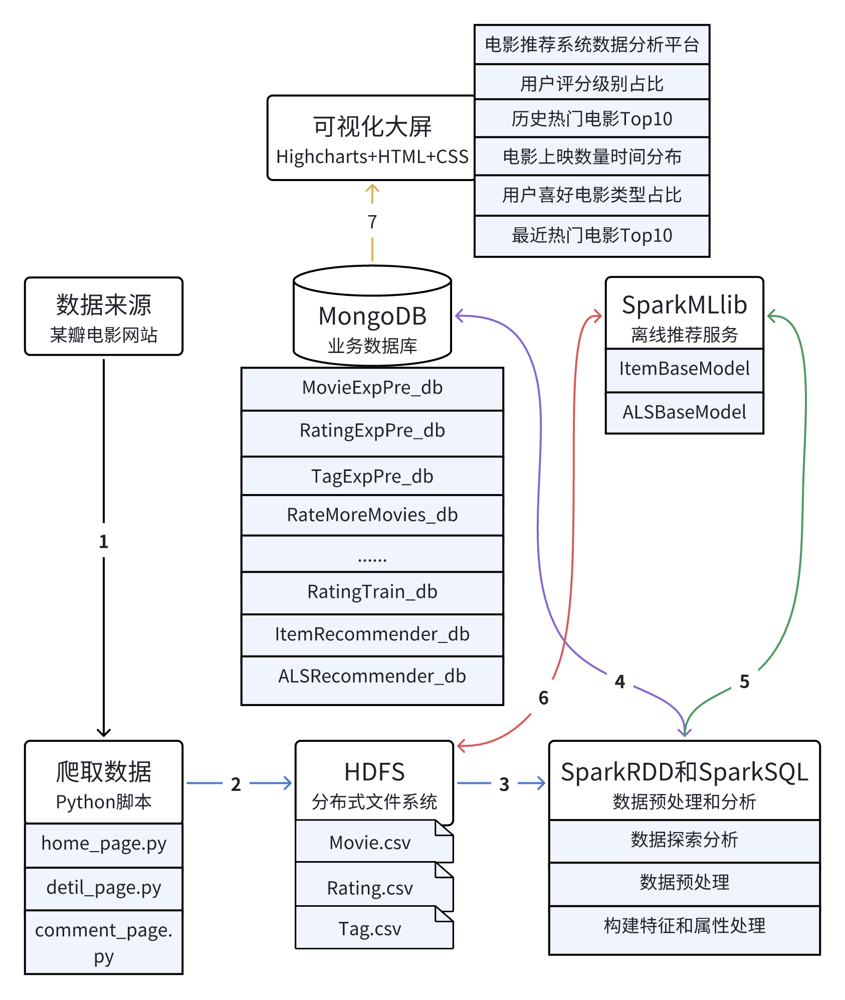
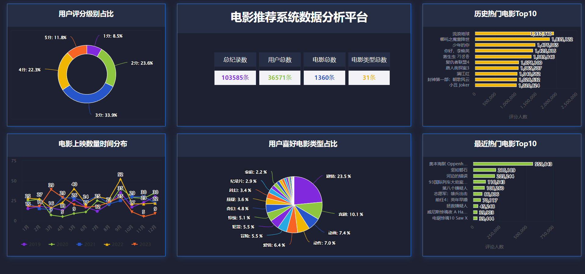

### 项目介绍

本项目研究基于Spark MLlib平台的协同过滤电影推荐系统。首先，使用爬虫工具从电影网站爬取电影信息和用户评论，并对原始数据进行探索分析。然后，对数据进行预处理，包括处理重复、缺失和异常数据。接着，构建特征和属性处理，包括属性规约、统计历史热门电影、最近热门电影、电影平均得分和类型优质电影等，并对数据进行编码。电影推荐模型使用基于物品协同过滤算法和 Spark ALS 算法的推荐模型，并对模型进行评测和预测。最后，将模型应用于实际场景，使用模型向用户推荐20部电影，并使用Highcharts图表库实现可视化大屏展示。本项目的研究对于电影推荐系统的发展具有重要意义，有助于提高推荐系统的准确性和多样性。

### 项目架构图



### 项目结构

首先，使用爬取数据的脚本获取电影数据。然后，将获取到的数据保存到HDFS（Hadoop分布式文件系统）中。从HDFS中读取数据并将其导入到MongoDB数据库中。接下来，使用SparkSQL对数据进行处理，并将处理结果再次保存到MongoDB数据库中。同时，使用SparkMLlib生成模型，并将模型保存到HDFS中。最后，将数据统计分析结果和模型推荐结果通过Highcharts以图的方式呈现出来，如下图所示。

```
├─.idea
│  ├─codeStyles
│  ├─inspectionProfiles
│  └─libraries
├─data					// 项目所需数据
│  ├─ALSBestModel
│  ├─ALSBestParam
│  ├─ALSTipDM
│  ├─BaseData			// 原始数据
│  ├─bestModel
│  ├─ItemCFModel
│  └─web_data			// 可视化大屏JSON数据
├─GetMoiveData  		// 爬虫源码
├─image  				// 结果图
├─resources   			// 日志设置
├─src    				// 推荐源码
└─VisualLargeScreen  	// 可视化源码
    ├─css
    ├─fonts
    └─js
```

### 实现流程

-  爬取数据：爬取数据用Python进行爬取，如urllib、fake_useragent、requests、lxml等。
-  数据存储：将文件数据导入数据库，用MongoDB进行存储。
- 基础数据探索：用SparkRDD，SparkSQL等探索数据本身特征，如记录数探索，数据类型分析，缺失、冗余、重复、异常数据探索分析，并使用表格进行辅助展示。
- 数据业务方面的探索：用SparkRDD，SparkSQL等结合项目目标，探索相关字段的数值分布情况，字段与字段之间的联系，得出相关结论。
-  数据预处理：使用SparkRDD、SparkSQL等对数据进行预处理，如处理重复数据、缺失数据、异常数据，并构建特征和属性处理。
- 模型构建：用基于物品过滤协同算法和SparkALS算法等，选取合适数据作为建模样本数据，构建不同的智能推荐模型并进行评估，根据模型的效果情况对模型进行优化，确定最终模型。选择效果较优的为最终模型，将模型保存，并将其应用至实际产生的数据，得出推荐结果集。
-  可视化平台，将电影数据和推荐结果数据以网站形式呈现出来。使用Highcharts图表库。

### 分析方法及工具使用

1、 编写代码工具IDEA2019和Anaconda3

2、 电影数据爬取使用Python3.9

3、 原始数据存储使用Hadoop3.1.3

4、 数据处理使用Spark3.1.3快速运算

5、 处理后数据存储使用MongoDB5.6数据库

6、 可视化大屏使用HTML、CSS、Highcharts图表库

### 可视化图（非响应式）



#### 警告：此数据来源于豆瓣电影，仅适用于个人学习与研究目的。严禁将其用于商业用途。